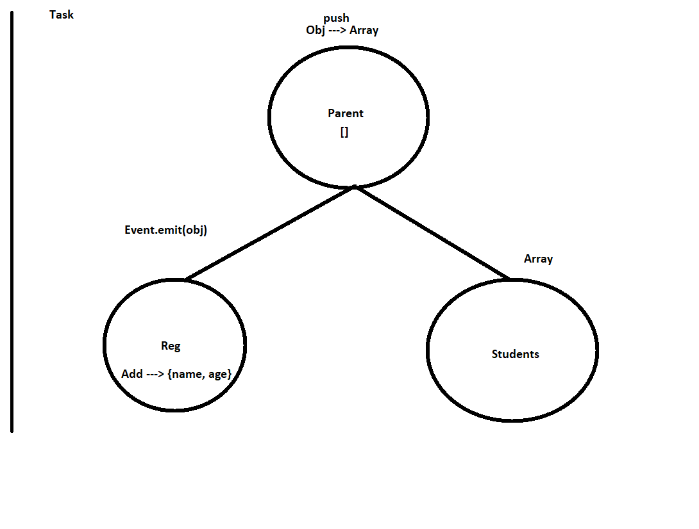
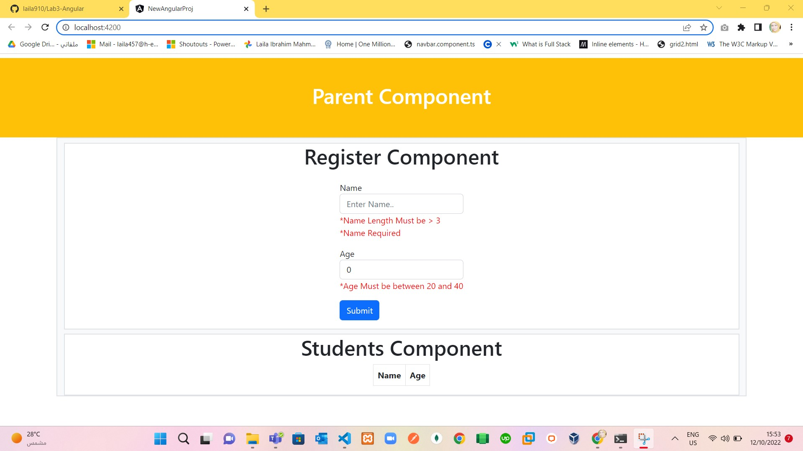
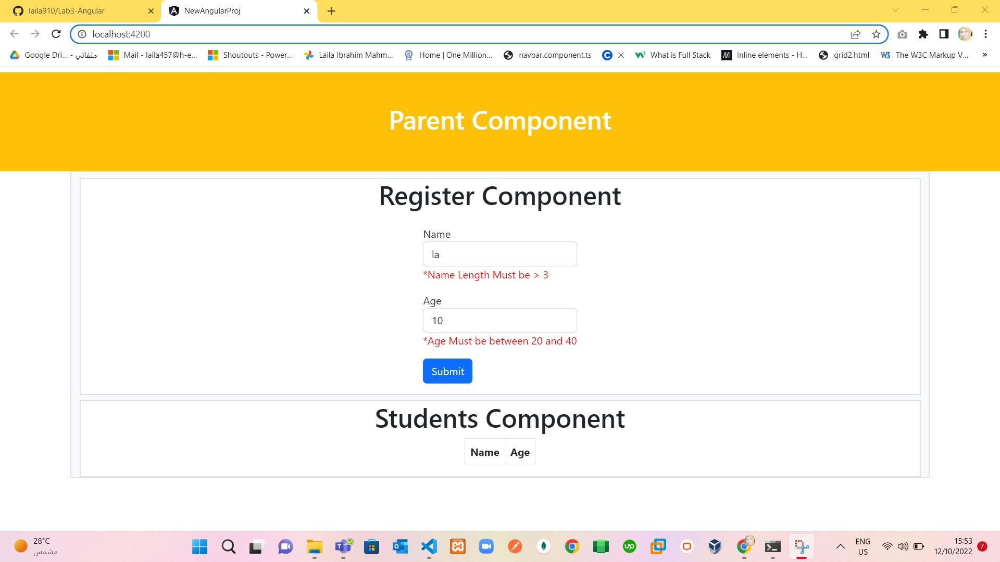
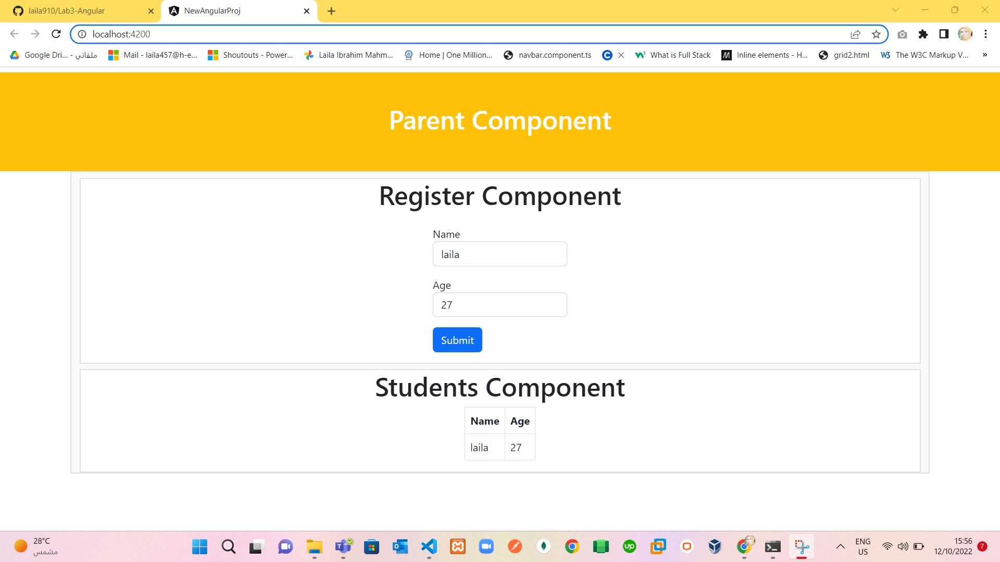

# Lab 3  Angular 

> Requirements:
 1. make 2 component in your parent component.
 2. One component `Register` for Form registering (name,age) with validations , name mustn't be less than 3 characters and age between 20 to 40. 
 3. the other Component `Students` for showing all data in table .
 4. Use @input, @output and Event for passing this Data between 3 components :)
 5. All is set as in:
    

> Solve:
 1. run project by `ng serve -o`.
 2. create `register` and `students` components by `ng g c register --skip-tests` and ` ng g c students --skip-tests`.
 3. add bootstrap links in `index.html`.
 4. get object from `register` component and turn it to parent component `app`.
 5. in parent component `app` push this object to array.
 6. in parent component `app` turn this array to `students` component.
 7. showing this valid data in table in `students` component.
 8. structure as in :
  
 9. when try enter name in 2 characters and age less than 3 characters and that prevent to show in table if i click submit :) as in:
  
 10. enter valid data and if valid data that will push to table :) as in:
  
 11. finish :) 

